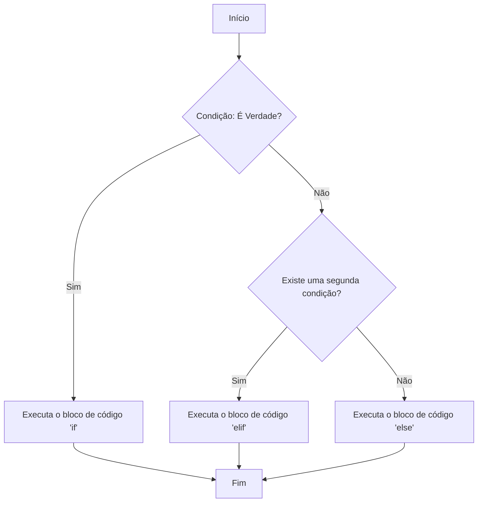

# Estruturas Condicionais em Python

## Objetivo da Aula

Nesta aula, vamos explorar as **estruturas condicionais** em Python, que permitem a criação de fluxos de decisão nos programas, essencialmente permitindo que o código tome diferentes caminhos dependendo das condições especificadas.

### O que são Estruturas Condicionais?

Estruturas condicionais são comandos que controlam o fluxo de execução do programa com base em condições lógicas. A mais simples delas é o **`if`**, mas também temos as variações **`else`** e **`elif`**, que adicionam mais flexibilidade às decisões.

Em termos técnicos, uma estrutura condicional avalia uma **expressão booleana** — uma expressão que resulta em **`True`** ou **`False`** — e executa um bloco de código específico se a condição for verdadeira.

### Operadores de Comparação

Para criar condições, utilizamos **operadores de comparação** que comparam valores e retornam `True` ou `False`. Os principais operadores de comparação em Python são:

- `==` : igual a
- `!=` : diferente de
- `>`  : maior que
- `<`  : menor que
- `>=` : maior ou igual a
- `<=` : menor ou igual a

**Exemplo**:

```python
a = 5
b = 10

print(a == b)  # False
print(a < b)   # True
```

Esses operadores são usados para construir as condições que as estruturas `if`, `elif` e `else` avaliam.

### Operadores Lógicos

Os **operadores lógicos** são utilizados para combinar múltiplas condições, permitindo que você crie estruturas condicionais mais complexas. Em Python, os operadores lógicos são:

- `and` : Retorna `True` se **ambas** as condições forem verdadeiras.
- `or`  : Retorna `True` se **pelo menos uma** das condições for verdadeira.
- `not` : Inverte o valor lógico da condição.

**Exemplo**:

```python
idade = 25
habilitado = True

if idade >= 18 and habilitado:
    print("Você pode dirigir.")
```

Nesse exemplo, utilizamos o operador `and` para garantir que **ambas** as condições (`idade >= 18` e `habilitado`) sejam verdadeiras para que o código dentro do `if` seja executado.

### Analogia

Pense em estruturas condicionais como **um cruzamento** no trânsito. Se o semáforo estiver verde, você segue em frente. Se estiver vermelho, você para. Dependendo da cor do semáforo *(a condição)*, você toma diferentes ações (decisões). No Python, o `if`, `elif`, e `else` fazem exatamente isso: avaliam condições e determinam qual bloco de código executar.

### Estrutura Básica: `if`

A forma mais simples de uma estrutura condicional é o `if`. Ele executa um bloco de código se a condição for verdadeira.

```python
if condição:
    # bloco de código a ser executado se a condição for verdadeira
```

**Exemplo**:

```python
idade = 18

if idade >= 18:
    print("Você é maior de idade.")
```

Aqui, se a variável `idade` for maior ou igual a 18, a mensagem **"Você é maior de idade."** será exibida.

### `else`: O Caminho Alternativo

O `else` é usado para definir o que deve ser feito quando a condição do `if` não é verdadeira.

```python
if condição:
    # bloco de código se a condição for verdadeira
else:
    # bloco de código se a condição for falsa
```

**Exemplo**:

```python
idade = 16

if idade >= 18:
    print("Você é maior de idade.")
else:
    print("Você é menor de idade.")
```

Nesse caso, como `idade` é 16, a condição do `if` é falsa, então o bloco do `else` é executado, e a mensagem **"Você é menor de idade."** aparece.

### `elif`: Múltiplas Condições

Quando temos mais de duas possibilidades, utilizamos o `elif` (abreviação de **else if**). O `elif` permite adicionar mais condições antes de chegar ao `else` final.

```python
if condição1:
    # bloco de código se a condição1 for verdadeira
elif condição2:
    # bloco de código se a condição2 for verdadeira
else:
    # bloco de código se nenhuma condição anterior for verdadeira
```

**Exemplo**:

```python
nota = 75

if nota >= 90:
    print("Aprovado com excelência!")
elif nota >= 70:
    print("Aprovado.")
else:
    print("Reprovado.")
```

### Exemplo em Fluxograma



Esse fluxograma representa um exemplo básico de um programa que usa `if`, `elif`, e `else` para tomar decisões com base nas condições. É uma forma visual de entender como o fluxo do programa muda dependendo das condições encontradas.

### Estruturas Condicionais Aninhadas

Às vezes, podemos ter uma estrutura condicional dentro de outra. Isso é chamado de **aninhamento** e é útil quando uma condição depende de outra.

```python
if condição1:
    if condição2:
        # bloco de código se ambas as condições forem verdadeiras
    else:
        # bloco de código se condição1 for verdadeira e condição2 for falsa
else:
    # bloco de código se condição1 for falsa
```

**Exemplo**:

```python
idade = 20
habilitado = True

if idade >= 18:
    if habilitado:
        print("Você pode dirigir.")
    else:
        print("Você precisa de uma habilitação.")
else:
    print("Você é menor de idade para dirigir.")
```

### Exemplos Práticos

1. **Comparação de variáveis**

    ```python
    a = 33
    b = 200
    
    if not a > b:
        print("a NÃO é maior que b")
    elif a > b:
        print("a é MAIOR que b")
    elif a == b:
        print("a é IGUAL a b")
    else:
        print("a é MENOR que b")
    ```

2. **Verificação de Par ou Ímpar**

    ```python
    numero = int(input("Digite um número: "))

    if numero % 2 == 0:
        print("O número é par.")
    else:
        print("O número é ímpar.")
    ```

### Exercícios Práticos

1. **Verificação de idade:** Crie um programa que pede ao usuário sua idade e, com base nela, informe se ele é menor de idade, maior de idade ou idoso (considerando idoso quem tem 65 anos ou mais).

2. **Classificação de números:** Faça um programa que peça ao usuário um número e informe se ele é negativo, positivo ou zero.

3. **Calculadora de desconto:** Desenvolva um programa que calcule o preço final de um produto aplicando um desconto dependendo do valor original. Se o valor for maior que R$100, aplique 10% de desconto. Se for menor ou igual a R$100, aplique 5%.

4. **Verificação de múltiplos:** Crie um programa que verifique se um número fornecido pelo usuário é múltiplo de 3, 5 ou ambos.

5. **Notas de um aluno:** Desenvolva um programa que receba a nota de um aluno e retorne a mensagem “Aprovado com distinção” se a nota for 9 ou 10, “Aprovado” se a nota for entre 7 e 8, e “Reprovado” se a nota for menor que 7.

6. **Calculadora Simples:** Desenvolva um programa que pergunte ao usuário qual operação ele deseja fazer (+, -, *, /) e dois números, realizando a operação e mostrando o resultado. Não se esqueça de tratar a divisão por zero.
