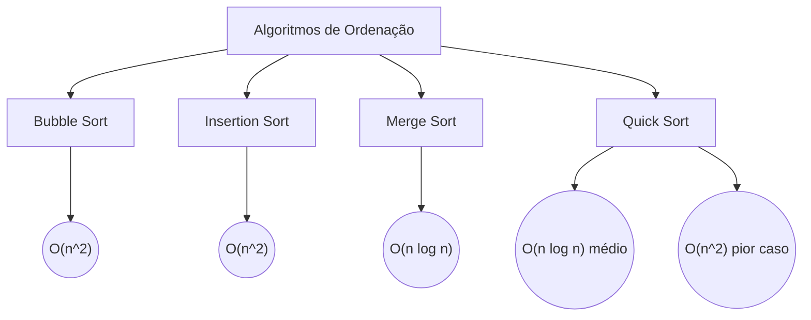

# Funções de Ordenação em Python

## Objetivo da Aula

- Entender a importância da ordenação em programação
- Aprender os algoritmos de ordenação mais comuns
- Verificar a diferença de performance e casos de uso entre esses algoritmos

## 1. Importância da Ordenação

A ordenação é essencial em diversos contextos na programação e ciência de dados. Ela melhora a eficiência de outras operações, como:

- Busca binária (muito mais rápida em listas ordenadas)
- Detecção de duplicatas
- Mineração de dados e análises que exigem organização
- Otimização da apresentação de dados ao usuário

No Python, a ordenação é nativamente suportada com métodos embutidos como `.sort()` e `sorted()`, que implementam uma versão otimizada do algoritmo **Timsort** (mistura de Merge Sort e Insertion Sort).

## 2. Algoritmos de Ordenação Clássicos

Vamos ver alguns algoritmos populares de ordenação e como eles funcionam. Cada um tem vantagens e desvantagens, dependendo do tipo de dados e da aplicação.

### 2.1 Bubble Sort

Um dos algoritmos mais simples. Ele compara elementos adjacentes e troca-os, se estiverem fora de ordem. É conhecido por ser lento para grandes listas, mas é fácil de implementar.

```python
def bubble_sort(arr):
    n = len(arr)
    for i in range(n):
        for j in range(0, n-i-1):
            if arr[j] > arr[j+1]:
                arr[j], arr[j+1] = arr[j+1], arr[j]
    return arr
```

**Complexidade**: `O(n²)` no pior caso

### 2.2 Insertion Sort

Ideal para listas pequenas e quase ordenadas. Ele pega cada elemento e o insere na posição correta, como se estivesse organizando cartas.

```python
def insertion_sort(arr):
    for i in range(1, len(arr)):
        key = arr[i]
        j = i - 1
        while j >= 0 and key < arr[j]:
            arr[j + 1] = arr[j]
            j -= 1
        arr[j + 1] = key
    return arr
```

**Complexidade**: `O(n²)` no pior caso

### 2.3 Merge Sort

É um algoritmo **divide e conquista**. Ele divide o array em duas metades, ordena cada metade e depois as combina. Ótimo para listas grandes.

```python
def merge_sort(arr):
    if len(arr) > 1:
        mid = len(arr) // 2
        L = arr[:mid]
        R = arr[mid:]
        
        merge_sort(L)
        merge_sort(R)
        
        i = j = k = 0
        while i < len(L) and j < len(R):
            if L[i] < R[j]:
                arr[k] = L[i]
                i += 1
            else:
                arr[k] = R[j]
                j += 1
            k += 1
        while i < len(L):
            arr[k] = L[i]
            i += 1
            k += 1
        while j < len(R):
            arr[k] = R[j]
            j += 1
            k += 1
    return arr
```

**Complexidade**: `O(n log n)` no pior e melhor caso

### 2.4 Quick Sort

Também é um algoritmo de **divide e conquista**. Ele seleciona um "pivô" e organiza os elementos em torno desse pivô. É eficiente para listas grandes e, em média, mais rápido que o Merge Sort.

```python
def quick_sort(arr):
    if len(arr) <= 1:
        return arr
    else:
        pivot = arr[len(arr) // 2]
        left = [x for x in arr if x < pivot]
        middle = [x for x in arr if x == pivot]
        right = [x for x in arr if x > pivot]
        return quick_sort(left) + middle + quick_sort(right)
```

**Complexidade**: `O(n log n)` em média, mas O(n²) no pior caso

## 3. Comparando Algoritmos de Ordenação

Aqui está uma visão comparativa entre os algoritmos:



### Explicando Complexidade `O`

**1. O que é a "Complexidade"?**

A "complexidade" de um algoritmo é uma maneira de medir o quão rápido ou lento ele vai trabalhar conforme o tamanho da lista ou do conjunto de dados aumenta. Em resumo, quanto maior a lista, mais tempo o algoritmo de ordenação pode precisar para organizar os itens.

**2. O que significa o "O"?**

O "O" vem de "Ordem" (ou "Order" em inglês), e é uma notação matemática que nos ajuda a entender como o tempo de execução de um algoritmo cresce conforme o número de itens aumenta. A complexidade mostra como a execução do algoritmo "escala" com diferentes tamanhos de listas.

### Explicando os Tipos de Complexidade com Exemplos Simples

- **O(n)**: Esse tipo de complexidade é muito eficiente. Imagine que temos uma lista de 10 itens. Com uma complexidade **O(n)**, o algoritmo precisa fazer cerca de 10 operações para ordenar. Se a lista tiver 100 itens, ele faz cerca de 100 operações. Ou seja, cresce "de igual para igual" com o tamanho da lista.
  
- **O(n²)**: Esse tipo é menos eficiente, e o tempo cresce mais rapidamente. Se uma lista tiver 10 itens, o algoritmo pode fazer cerca de 10 x 10 = 100 operações para ordenar (número de itens ao quadrado). Se a lista tiver 100 itens, ele faz 100 x 100 = 10.000 operações. Percebemos que ele fica bem mais lento quando o tamanho da lista aumenta.

- **O(n log n)**: Essa complexidade é uma mistura entre as anteriores. Imagine uma lista com 100 itens: o algoritmo faz menos que 100 x 100 operações, mas mais do que 100 operações. Esse tipo de complexidade é considerado rápido para listas grandes.

### Trazendo para a Tabela

Podemos reformular a tabela de complexidade, sem a notação "O", mas indicando a eficiência em termos de listas pequenas e grandes:

| Algoritmo       | Listas Pequenas      | Listas Grandes         | Estável? |
|:-----------------:|:----------------------:|:-------------------------:|:----------:|
| Bubble Sort     | Lento                | Muito lento            | Sim      |
| Insertion Sort  | Rápido               | Muito lento            | Sim      |
| Merge Sort      | Rápido               | Rápido                 | Sim      |
| Quick Sort      | Rápido               | Rápido (mas pode ser lento em alguns casos) | Não |

### Explicação Simplificada da Tabela

- **Bubble Sort** e **Insertion Sort**: São métodos que podem funcionar bem para listas pequenas, mas tornam-se muito lentos para listas grandes.

- **Merge Sort** e **Quick Sort**: São métodos rápidos e funcionam bem para listas grandes. O Quick Sort é ligeiramente mais rápido, mas pode ter problemas em alguns casos especiais.

### Resumindo o Conceito

A ideia principal é que, quanto maior a lista, mais importante é escolher um algoritmo que "escale" bem. Por isso, geralmente preferimos algoritmos como Merge Sort e Quick Sort para listas grandes e evitamos Bubble Sort e Insertion Sort quando o número de itens aumenta.

## 4. Demonstração Gráfica de Comparação de Algoritmos

Usando gráficos, podemos ver a diferença de tempo de execução entre os algoritmos com tamanhos de listas variados. Vamos implementar um exemplo gráfico no Python:

```python
import matplotlib.pyplot as plt
import time
import random

def measure_time(sort_function, arr):
    start_time = time.time()
    sort_function(arr.copy())
    return time.time() - start_time

sizes = [100, 200, 500, 1000]
bubble_times = []
insertion_times = []
merge_times = []
quick_times = []

for size in sizes:
    arr = [random.randint(0, 1000) for _ in range(size)]
    bubble_times.append(measure_time(bubble_sort, arr))
    insertion_times.append(measure_time(insertion_sort, arr))
    merge_times.append(measure_time(merge_sort, arr))
    quick_times.append(measure_time(quick_sort, arr))

plt.plot(sizes, bubble_times, label='Bubble Sort', color='blue')
plt.plot(sizes, insertion_times, label='Insertion Sort', color='orange')
plt.plot(sizes, merge_times, label='Merge Sort', color='green')
plt.plot(sizes, quick_times, label='Quick Sort', color='red')

plt.xlabel('Tamanho da Lista')
plt.ylabel('Tempo de Execução (s)')
plt.legend()
plt.title('Comparação de Algoritmos de Ordenação')
plt.show()
```

Este gráfico compara o tempo de execução para cada algoritmo conforme o tamanho da lista cresce, mostrando como algoritmos como o Bubble Sort e o Insertion Sort começam a ter dificuldades com listas maiores, enquanto Merge Sort e Quick Sort mantêm uma performance estável.

### Conclusão

- **Bubble Sort** e **Insertion Sort**: Simples, mas não ideais para listas grandes
- **Merge Sort**: Muito eficiente, especialmente para grandes listas e quando é necessário uma ordenação estável
- **Quick Sort**: Rápido na maioria dos casos, mas pode ser pior em listas já ordenadas ou com muitos elementos repetidos.

## 5. Uso do `sorted()` e `.sort()` no Python

Em Python, temos o método embutido `.sort()` para listas e a função `sorted()` que funciona em qualquer iterável e retorna uma nova lista ordenada, sem modificar a original.

**Função `sort()`**

A função `sort()` é um método de lista que modifica a própria lista original, ordenando seus elementos. É uma ordenação "in-place", ou seja, não cria uma nova lista, apenas altera a existente.

- **Uso**: `lista.sort()`
- **Parâmetros**:

  - `reverse`: permite que a lista seja ordenada em ordem decrescente se `True`.
  - `key`: uma função que define um critério para a ordenação. Exemplo: `key=len` para ordenar por tamanho dos elementos.

```python
numeros = [5, 3, 8, 1]
numeros.sort()  # Ordena em ordem crescente
print(numeros)  # Saída: [1, 3, 5, 8]

# Exemplo com parâmetros
numeros.sort(reverse = True)  # Ordena em ordem decrescente
print(numeros)  # Saída: [8, 5, 3, 1]
```

**Função `sorted()`**

A função `sorted()` é uma função global que pode ser usada para ordenar qualquer iterável (como listas, tuplas, dicionários, etc.) e **retorna uma nova lista** com os elementos ordenados, deixando o original intacto.

- **Uso**: `sorted(iterável, reverse = False, key = None)`
- **Parâmetros**: `reverse` e `key` funcionam da mesma forma que em `sort()`.

```python
numeros = [5, 3, 8, 1]
ordenados = sorted(numeros)  # Cria uma nova lista ordenada
print(ordenados)  # Saída: [1, 3, 5, 8]
print(numeros)    # A lista original permanece: [5, 3, 8, 1]

# Exemplo com chave de ordenação
palavras = ["casa", "apartamento", "quarto", "loft"]
ordenadas_por_tamanho = sorted(palavras, key = len)
print(ordenadas_por_tamanho)  # Saída: ['loft', 'casa', 'quarto', 'apartamento']
```
